[comment]: # (title: Setup a Posfix Email Relay Service)
[comment]: # (version: v1.0)
[comment]: # (author: Kuan Cheang)

# This is a mermaid example

Here we will show an mermaid flow diagram by markdown codeblock

## Example

### Basic Pie Chart

```text
pie title NETFLIX
         "Time spent looking for movie" : 90
         "Time spent watching it" : 10
```

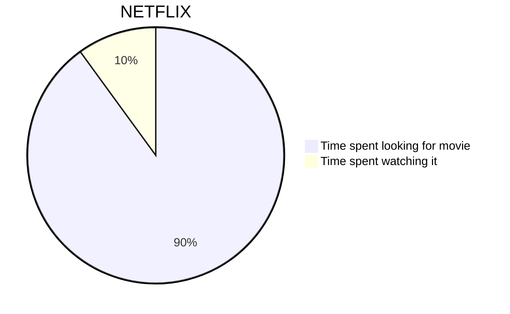

### Basic sequence diagram

```text
sequenceDiagram
    autonumber
    Alice->>John: Hello John, how are you?
    loop Healthcheck
        John->>John: Fight against hypochondria
    end
    Note right of John: Rational thoughts!
    John-->>Alice: Great!
    John->>Bob: How about you?
    Bob-->>John: Jolly good!
```

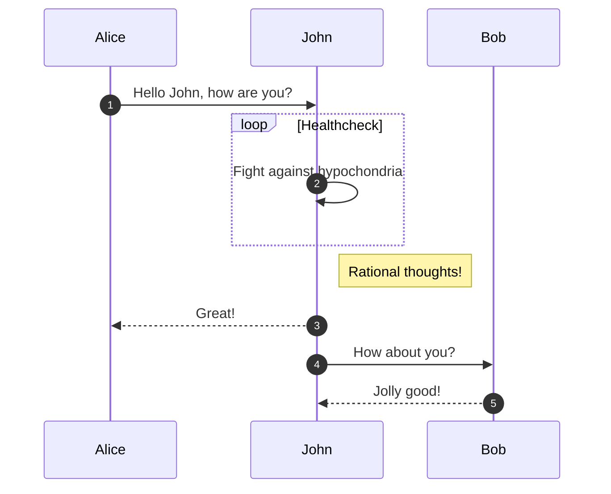

### Basic flowchart

```text
graph LR
    A[Square Rect] -- Link text --> B((Circle))
    A --> C(Round Rect)
    B --> D{Rhombus}
    C --> D
```

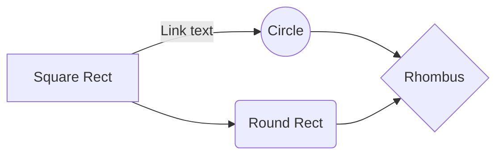

### Larger flowchart with some styling

```text
graph TB
    sq[Square shape] --> ci((Circle shape))

    subgraph A
        od>Odd shape]-- Two line<br/>edge comment --> ro
        di{Diamond with <br/> line break} -.-> ro(Rounded<br>square<br>shape)
        di==>ro2(Rounded square shape)
    end

    %% Notice that no text in shape are added here instead that is appended further down
    e --> od3>Really long text with linebreak<br>in an Odd shape]

    %% Comments after double percent signs
    e((Inner / circle<br>and some odd <br>special characters)) --> f(,.?!+-*ز)

     classDef green fill:#9f6,stroke:#333,stroke-width:2px;
     classDef orange fill:#f96,stroke:#333,stroke-width:4px;
     class sq,e green
     class di orange
```

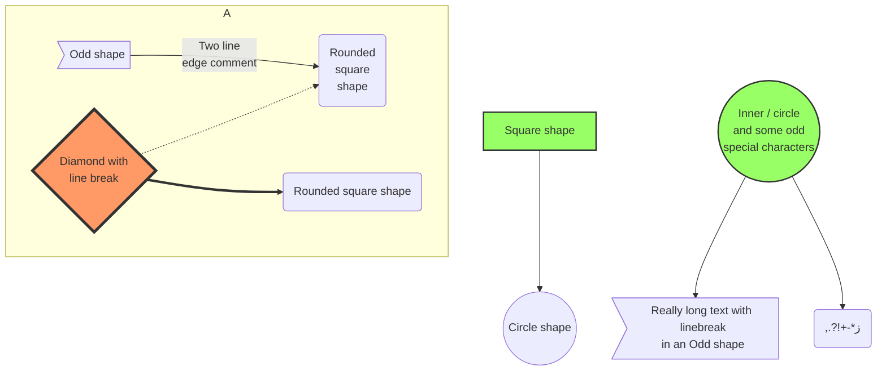

### User Journey Diagram

```text
journey
    title My working day
    section Go to work
      Make tea: 5: Me
      Go upstairs: 3: Me
      Do work: 1: Me, Cat
    section Go home
      Go downstairs: 5: Me
      Sit down: 5: Me
```

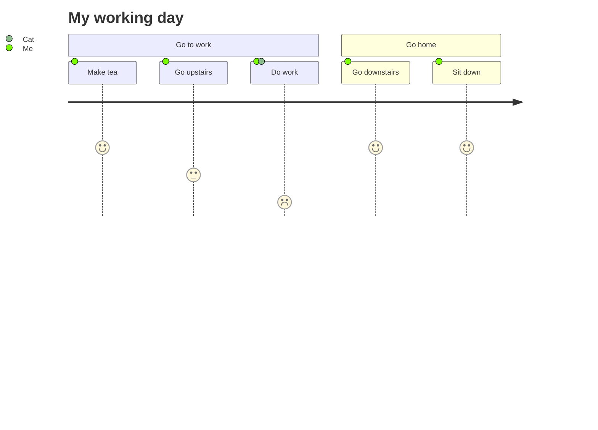

### State diagrams

```text
stateDiagram-v2
    [*] --> Still
    Still --> [*]

    Still --> Moving
    Moving --> Still
    Moving --> Crash
    Crash --> [*]
```

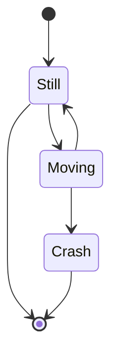

#### Composite state diagram

```text
stateDiagram-v2
    [*] --> First
    First --> Second
    First --> Third

    state First {
        [*] --> fir
        fir --> [*]
    }
    state Second {
        [*] --> sec
        sec --> [*]
    }
    state Third {
        [*] --> thi
        thi --> [*]
    }
```

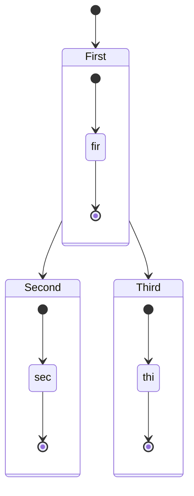

#### Concurrency

```text
stateDiagram-v2
        [*] --> Active

        state Active {
            [*] --> NumLockOff
            NumLockOff --> NumLockOn : EvNumLockPressed
            NumLockOn --> NumLockOff : EvNumLockPressed
            --
            [*] --> CapsLockOff
            CapsLockOff --> CapsLockOn : EvCapsLockPressed
            CapsLockOn --> CapsLockOff : EvCapsLockPressed
            --
            [*] --> ScrollLockOff
            ScrollLockOff --> ScrollLockOn : EvCapsLockPressed
            ScrollLockOn --> ScrollLockOff : EvCapsLockPressed
        }
```

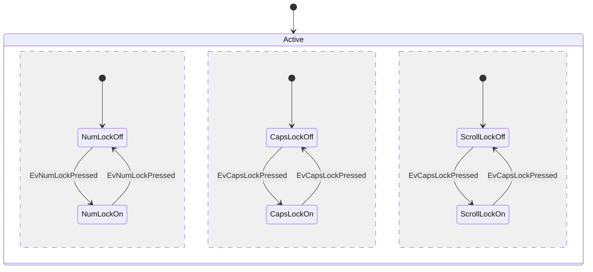

### Gantt diagrams

```text
gantt
    dateFormat                :YYYY-MM-DD
    title                     :Adding GANTT diagram functionality to mermaid
    excludes                  :excludes the named dates/days from being included in a charted task..
    section A section
    Completed task            :done,    des1, 2014-01-06,2014-01-08
    Active task               :active,  des2, 2014-01-09, 3d
    Future task               :         des3, after des2, 5d
    Future task2              :         des4, after des3, 5d

    section Critical tasks
    Completed task in the critical line :crit, done, 2014-01-06,24h
    Implement parser and jison          :crit, done, after des1, 2d
    Create tests for parser             :crit, active, 3d
    Future task in critical line        :crit, 5d
    Create tests for renderer           :2d
    Add to mermaid                      :1d

    section Documentation
    Describe gantt syntax               :active, a1, after des1, 3d
    Add gantt diagram to demo page      :after a1  , 20h
    Add another diagram to demo page    :doc1, after a1  , 48h

    section Last section
    Describe gantt syntax               :after doc1, 3d
    Add gantt diagram to demo page      :20h
    Add another diagram to demo page    :48h
```

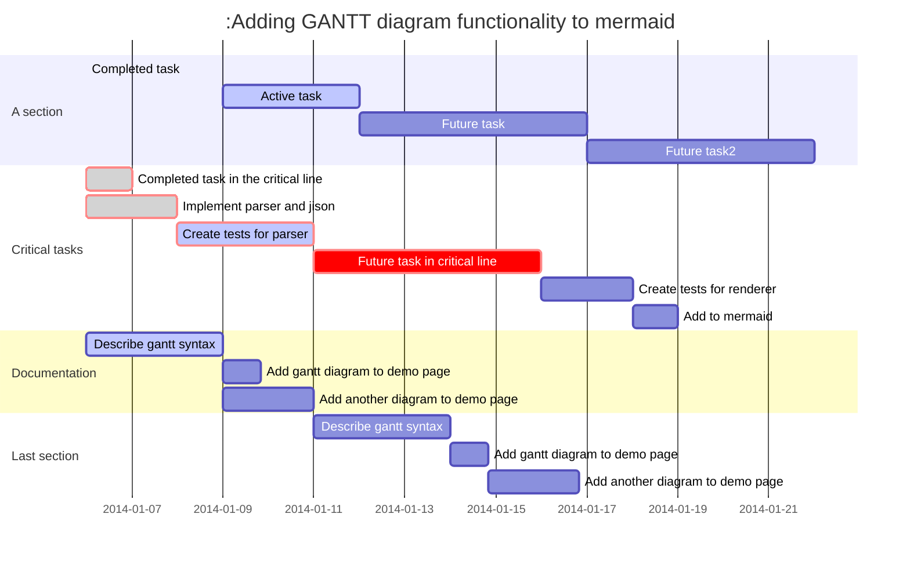

example 4:

```text
classDiagram
    Class01 <|-- AveryLongClass : Cool
    Class03 *-- Class04
    Class05 o-- Class06
    Class07 .. Class08
    Class09 --> C2 : Where am i?
    Class09 --* C3
    Class09 --|> Class07
    Class07 : equals()
    Class07 : Object[] elementData
    Class01 : size()
    Class01 : int chimp
    Class01 : int gorilla
    Class08 <--> C2: Cool label
```

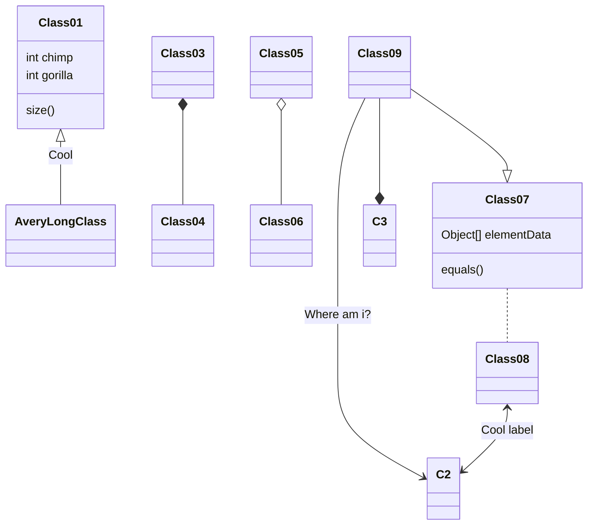

example 5:

```text
gitGraph:
options
{
    "nodeSpacing": 150,
    "nodeRadius": 5
}
end
commit
branch newbranch
checkout newbranch
commit
commit
checkout master
commit
commit
merge newbranch
```


example 6:

```text
erDiagram
    CUSTOMER ||--o{ ORDER : places
    ORDER ||--|{ LINE-ITEM : contains
    CUSTOMER }|..|{ DELIVERY-ADDRESS : uses
```

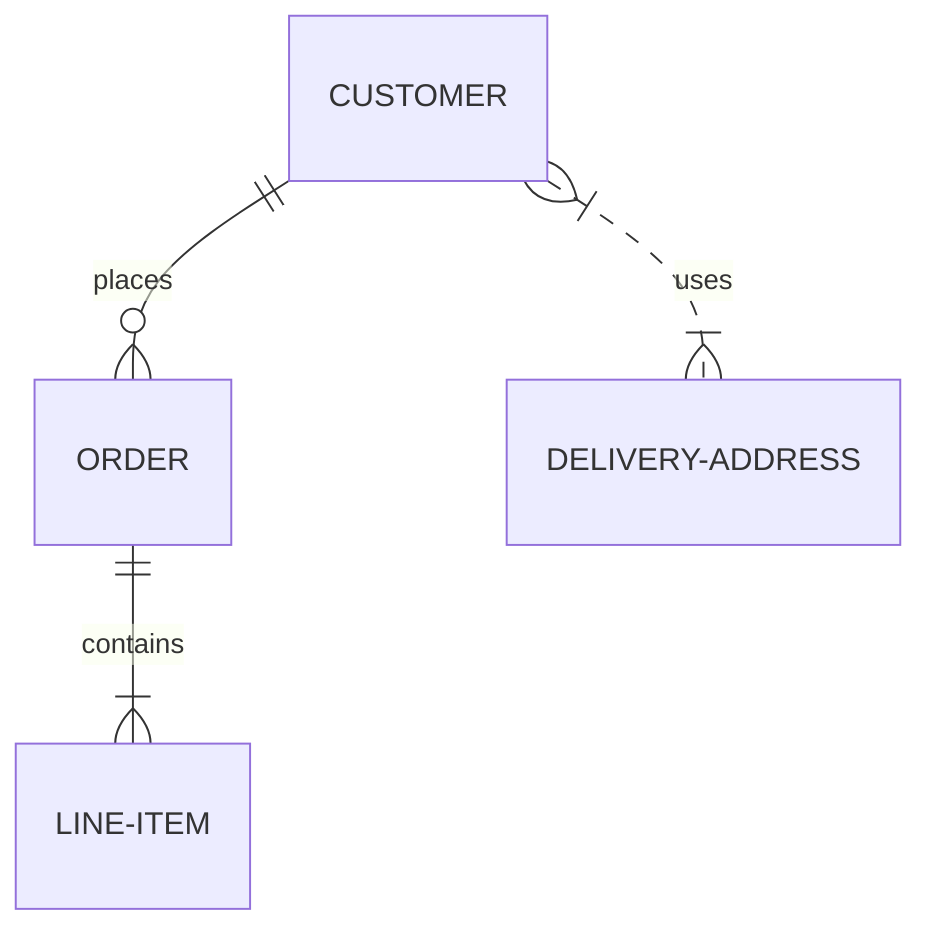
