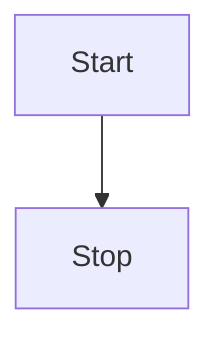
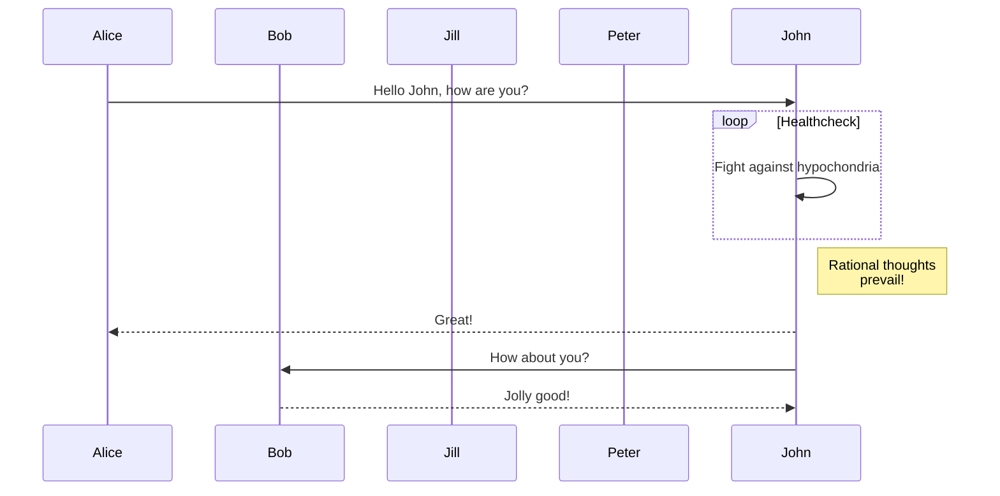
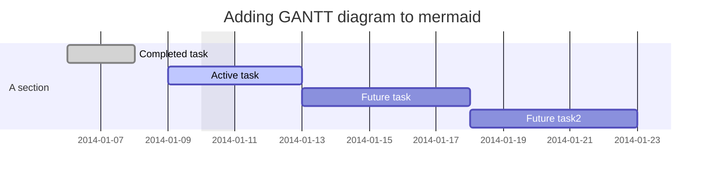
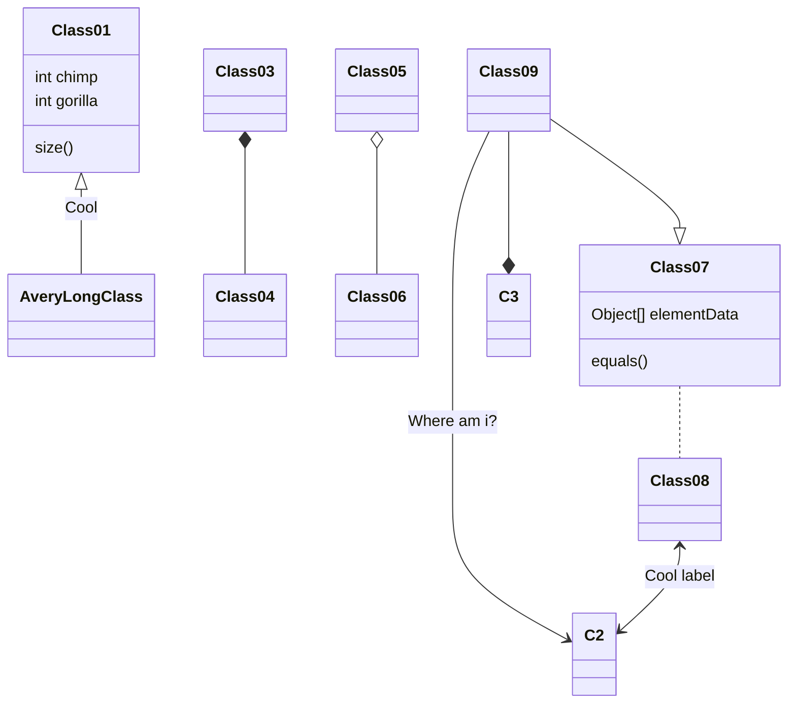

[comment]: # (title: Setup a Posfix Email Relay Service)
[comment]: # (version: v1.0)
[comment]: # (author: Kuan Cheang)

# This is a mermaid example

Here we will show an mermaid flow diagram by markdown codeblock

example 1:

example 2:

example 3:

example 4:

example 5:

